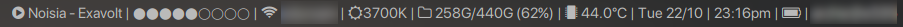

dwmbar - A Modular Status Bar for dwm
=====================================


dwmbar is a very simple status bar written for dwm.

**This project is no longer actively maintained. You will likely not receive support from the devs if something's not right. If you are somebody who is interested in taking over this project, please contact me (thytom) and we can discuss adding you as a contributor. You are also more than welcome to fork the project if you wish to make improvements on your own.**

# Installation

## Prerequisites

While some modules will work without these dependencies, we recommend grabbing
the ones you want for specific modules.

Highly Recommended:
* Any patched Nerd Font for icons.

Optional (By module):

See [module prerequisites](#module-prerequisites).


## Arch Linux

There is an [AUR package](https://aur.archlinux.org/packages/dwmbar-git) for
dwmbar, which can be installed with your favourite aur helper, or manually.

Please see the [archwiki
page](https://wiki.archlinux.org/index.php/Arch_User_Repository#Installing_packages)
for how to manually install AUR packages.

## Manual Installation

```bash
$ git clone https://github.com/thytom/dwmbar
$ cd dwmbar
$ sudo ./install.sh
```
# Usage

dwmbar works by setting the root window name, which dwm displays. It does this
by calling a config file. At runtime, dwmbar will use `~/.config/dwmbar/config` if it
exists, otherwise it will fall back to the default `/usr/share/dwmbar/config`.
You can copy defaults into your home directory with:

```bash
dwmbar -c
```

Add the line `dwmbar &` to your .xinitrc file to run on startup. You can also
run `dwmbar` in terminal for testing purposes.

# Customisation

## Configuring the Bar

Most non-modular configuration is done in `~/.config/dwmbar/config`, a bash
script that calls module scripts in turn, caching their output and then
constructing the bar from that.

To add a module to the bar, simply include its name in the MODULES variable:

```bash
MODULES="mpd volumebar wifi battery"
```

Modules are displayed left-to-right in the order they are written in `MODULES`.
By default, they are delimited by the `SEPARATOR` variable, which you can
change.

You can also set `LEFT_PADDING` and `RIGHT_PADDING` in the config to add
extra spacing (or text) at the left/right ends of the bar.

## Writing Modules

Default modules are located within `/usr/share/dwmbar/modules`, and custom
modules can be placed in `~/.config/dwmbar/modules/custom`. If a default module
exists with the same name as a custom module, then the custom module will take
precedence.

**Default modules will possibly be overwritten during updates, so if you want
to modify them be sure to make a copy in the custom folder, which will not be
touched, and edit it there.**

Modules can be written in any language, so long as they are executable and
print their output to stdout.

<details>
<summary><strong>Available default modules</strong></summary>

- archupdates		 - Gets the number of updates available <em>Arch Linux Only</em>
- backlight			 - Shows the brightness of the screen
- battery			 - Gets battery percentage
- bluetooth			 - Shows bluetooth status
- cpuload			 - Shows the CPU load in %
- date				 - Shows the calendar date
- daypercentage		 - Shows how far through the day you are, in %
- disksize			 - Shows the disk usage
- ethernet			 - Shows ethernet connection
- fanspeed           - Shows the rpm of your main fan
- hostname           - Shows your current user and hostname
- internet			 - Shows whether internet is available
- kernel             - Shows the kernel version
- localip            - Shows your local IP address
- mail				 - Shows how much mail you have
- mpd				 - Shows MPD status
- networkdowntraffic - Gets the download traffic in Kb/s
- networkuptraffic   - Gets the upload traffic in Kb/s
- publicip           - Shows your public IP address
- ram				 - Shows RAM usage
- redshift			 - Shows current screen temperature from Redshift
- sunmoon			 - Displays a sun or moon for time of day
- cputemp		 - Displays the temperature of the CPU
- time				 - Displays time
- todo				 - Prints the number of todos for the "t" todo manager
- tor				 - Prints if the tor service is enabled
- voidupdates        - Gets the number of updates available <em>Void Linux Only</em>
- volumebar			 - Displays a volume bar
- volume			 - Prints volume in %
- weather			 - Shows weather info
- wifi				 - Shows wifi connection

</details>

## Module Prerequisites  <a name="module-prerequisites"></a>

<details>
<summary><strong>Show module prerequisites</strong></summary>

 - archupdates
	- Arch Linux
	- yay
	- pacman-contrib
 - backlight
	- light
 - bluetooth
	- bluez
 - fanspeed
	- lm_sensors
 - mail
	- mutt/neomutt (We recommend [Luke Smith's Mutt-Wizard](https://github.com/LukeSmithxyz/mutt-wizard)) for configuration.
 - mpd
	- mpd
	- mpc
 - publicip
	- curl
 - redshift
	- redshift
 - sunmoon
	- redshift
 - temperature
	- lm_sensors
 - todo
	- [t todo manager](https://github.com/sjl/t)
 - tor
	- tor
 - voidupdates
	- xbps package manager
 - volume
	- PulseAudio or PipeWire
 - volumebar
	- PulseAudio or PipeWire
 - weather
	- curl
	- Internet connection
 - wifi
	- Wifi card

</details>

## Uninstallation

If you installed manually using the provided scripts, you can uninstall with:

```bash
sudo ./uninstall.sh
```

This removes `/usr/share/dwmbar` and `/usr/bin/dwmbar`. If you previously
copied configuration to your home directory via `dwmbar -c`, you may also
remove `~/.config/dwmbar` manually if desired.

# Join our amazing community as a code contributor

[](https://github.com/thytom/dwmbar/graphs/contributors)

# Feature Wishlist

<details>
<summary><strong>Show wishlist</strong></summary>

- Paralellised Modules
	- Some modules are slower than others. Have modules set a DELAY variable;
		if they don't have one, use a default.
	- Modules are called and bar is updated when a module finishes, but an
		internal bar clock updates the clock at a specific delay.

</details>
